# helloprofs 2.0 - Relation And Purchase Order Walkthrough

This document explains the supplied screens in order. It follows the user journey from the Relations overview, through assigning a service, into a relation detail page, and finally into the purchase-order overview and detail page.

## 1. Relations Overview

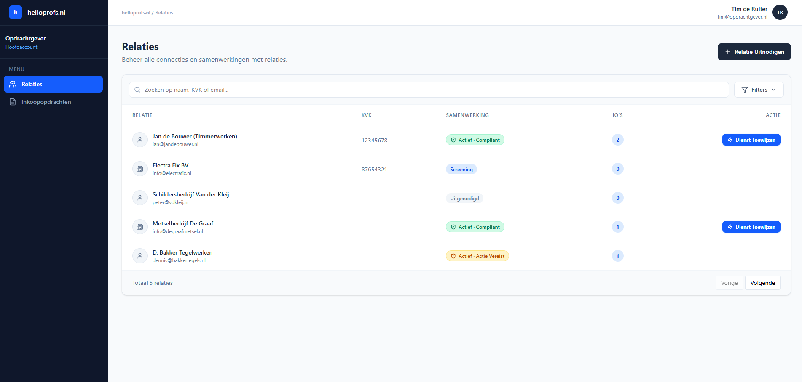

The Relations page is the starting point for managing contractors and business partners. The user can search for a relation, filter the list, invite a new relation, open a relation detail page, or assign a service directly from a row.

The first relation is marked as active and compliant, so the Assign Service action is available on that row. Relations that are still invited, in screening, or require compliance action cannot receive a new service assignment from this screen.

## 2. Invite Relation By WhatsApp

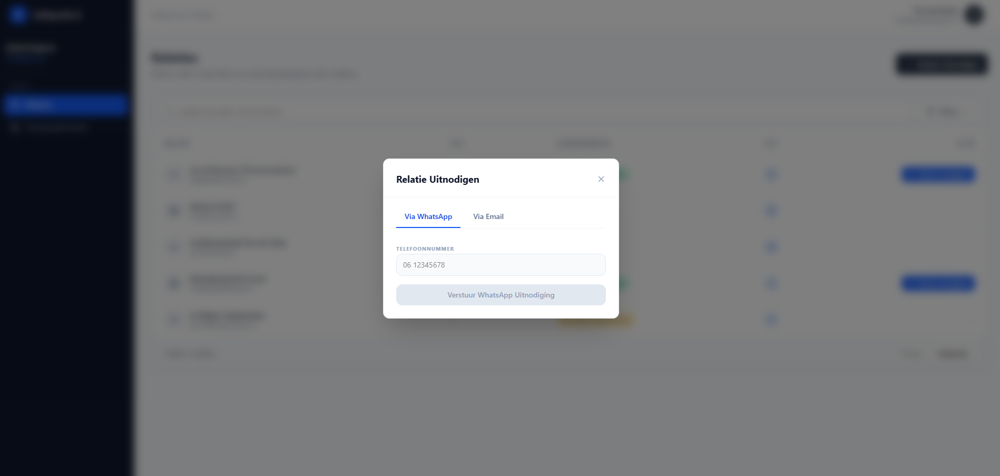

The Invite Relation modal opens on the WhatsApp tab. The user enters a phone number and sends a registration invitation by WhatsApp.

This step is used when a contractor first needs to be invited into the platform before purchase orders or services can be assigned.

## 3. Back To Relations Overview

After the invitation option has been reviewed, the flow returns to the Relations overview. This is where the user chooses the next action from the relation row.

For an active and compliant relation, the Assign Service button is available directly in the table. Selecting this action opens the service assignment modal for that relation.

## 4. Assign Service Context (with automatic Sub-order logging)

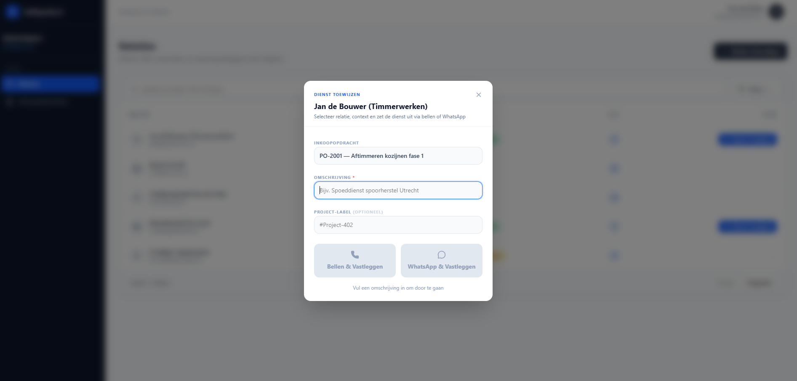

The Assign Service modal is opened for the selected relation. The purchase-order context is already selected, and the user is asked to describe the service that should be offered.

The call and WhatsApp actions remain disabled until the description is filled in. This ensures that every contact attempt is logged with enough context.

This function should only be available for a relation with a framework agreement, because the assigned service is logged as a sub-order under that agreement.

## 5. Assign Service Ready

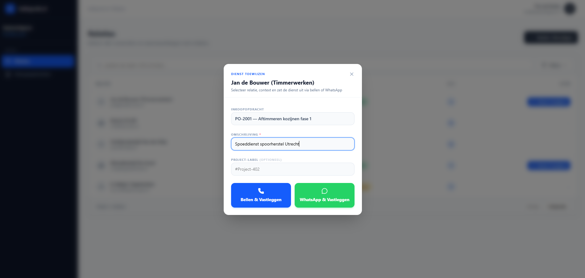

Once the description is entered, the call and WhatsApp buttons become active. The user can now choose how to contact the contractor.

The selected purchase order keeps the service connected to the right dossier, while the description explains what is being offered.

## 6. Record Call Outcome

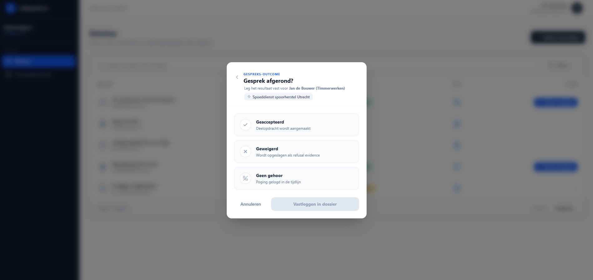

After choosing the call route, the user records the outcome of the conversation. Accepted means the service can move forward, refused stores refusal evidence, and no answer records the contact attempt without an acceptance.

This outcome is important because it becomes part of the dossier timeline and helps prove how the assignment was handled.

## 7. Relation Detail - Overview And Compliance

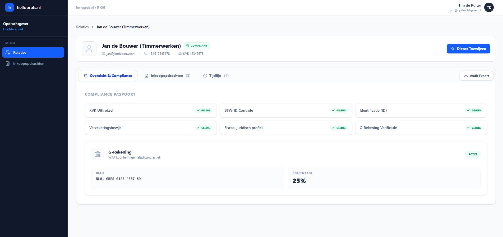

The relation detail page shows identity, contact details, Chamber of Commerce number, and compliance status. Because this relation is compliant, the Assign Service button is available from this page as well.

The Overview & Compliance tab shows the compliance passport and G-account information. This gives the user a quick confirmation that the required checks are valid before new work is assigned.

## 8. Audit Export

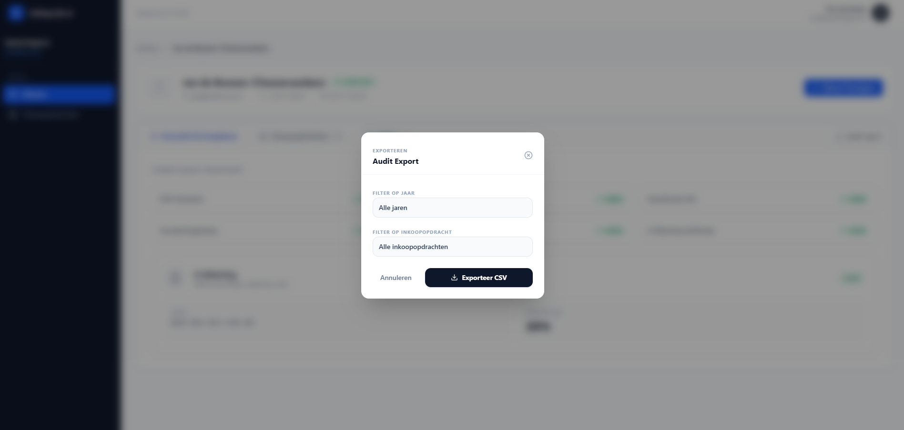

The Audit Export modal lets the user export timeline evidence for the relation. The export can be filtered by year and by purchase order.

This is useful when the client needs a focused CSV for audit review, especially around contact attempts, acceptances, refusals, and compliance events.

## 9. Relation Detail - Purchase Orders

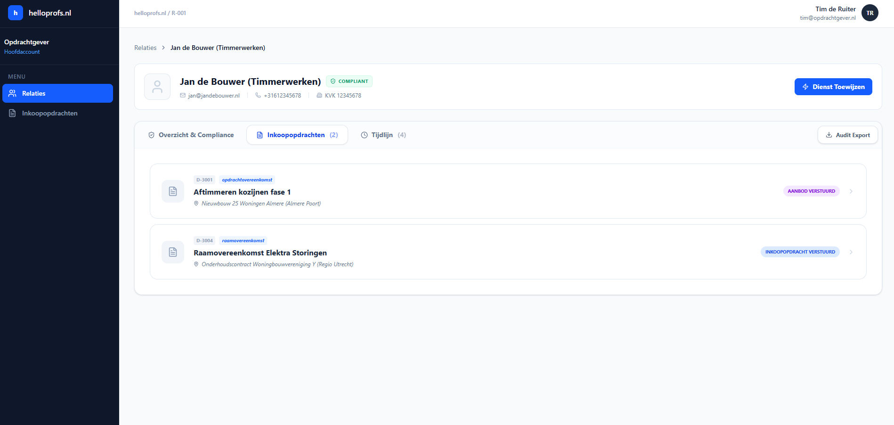

The Purchase Orders tab lists the dossiers connected to the selected relation. In this example, there are two linked dossiers: one standard assignment and one framework agreement.

Selecting a card opens the dossier detail inside the relation page, so the user stays in the relation context while reviewing the underlying purchase-order record.

## 10. Dossier - Purchase Order Tab

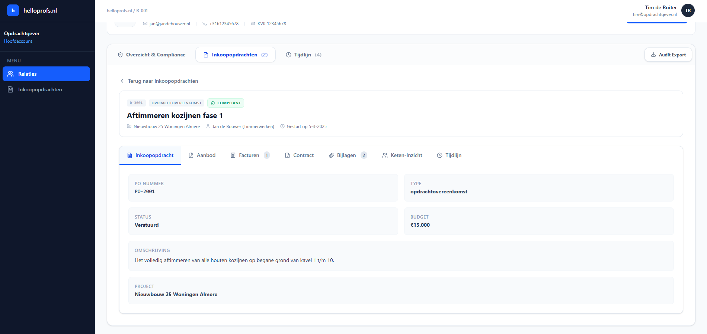

The selected dossier opens on the Purchase Order tab. This tab shows the original assignment details: PO number, type, status, budget, description, and linked project.

This is the core record for what was assigned and under which project context the work belongs.

## 11. Dossier - Chain Insight

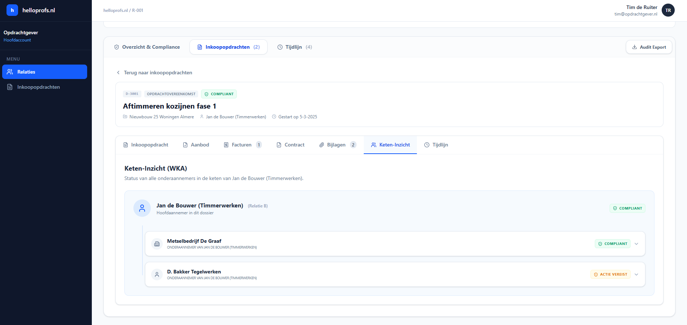

The Chain Insight tab shows the contractor chain for this dossier. The selected contractor is shown as the main relation, with linked subcontractors underneath.

Each party has its own compliance state. This helps the client identify WKA and chain-liability risks before work continues.

## 12. Dossier - Timeline

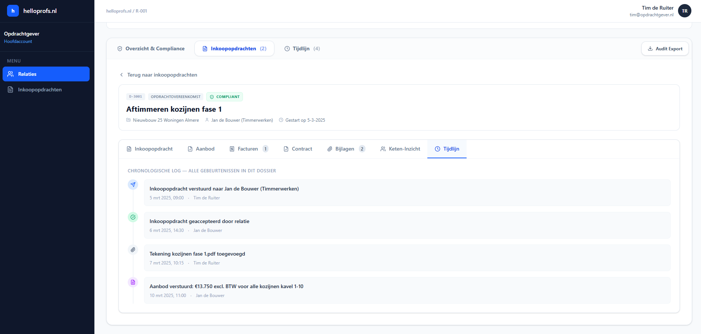

The Timeline tab shows the chronological event log for this dossier. It records when the purchase order was sent, when it was accepted, when attachments were added, and when the offer was submitted.

This screen is the operational audit trail for the dossier. It allows the user to reconstruct what happened, who performed each action, and when it happened.

## 13. Purchase Orders Overview

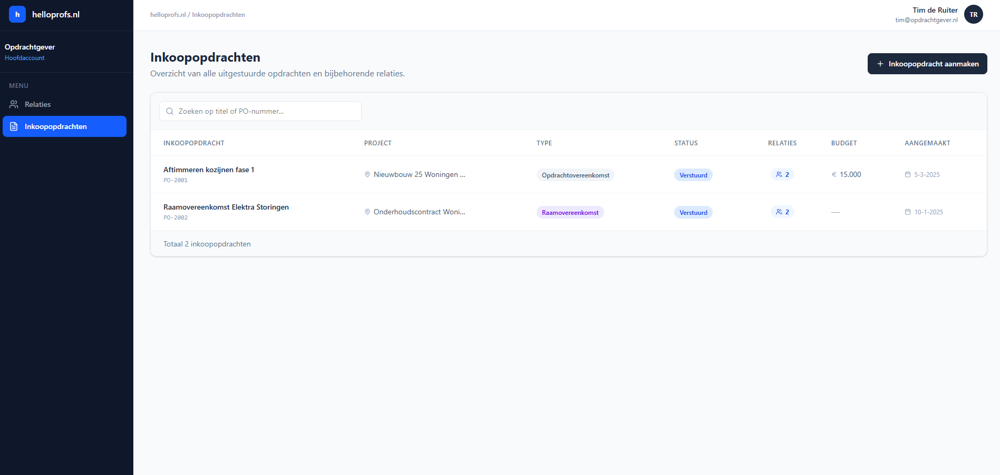

The separate Purchase Orders section shows all issued purchase orders across the client environment. This page is broader than the relation detail page because it is not limited to one relation.

The user can search by title or PO number, create a new purchase order, and open an existing purchase order for more detail.

## 14. Purchase Order Detail

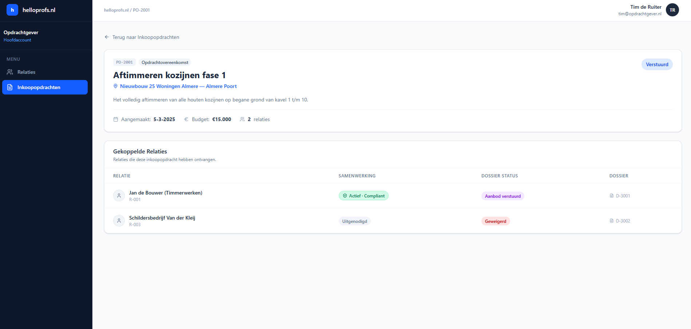

The purchase-order detail page shows the assignment itself and the relations that received it. In this example, the same purchase order was sent to two different relations.

Each linked relation has its own collaboration state and dossier status. One relation has submitted an offer, while the other relation has refused. This makes the purchase-order page useful for comparing responses across multiple invited parties.
